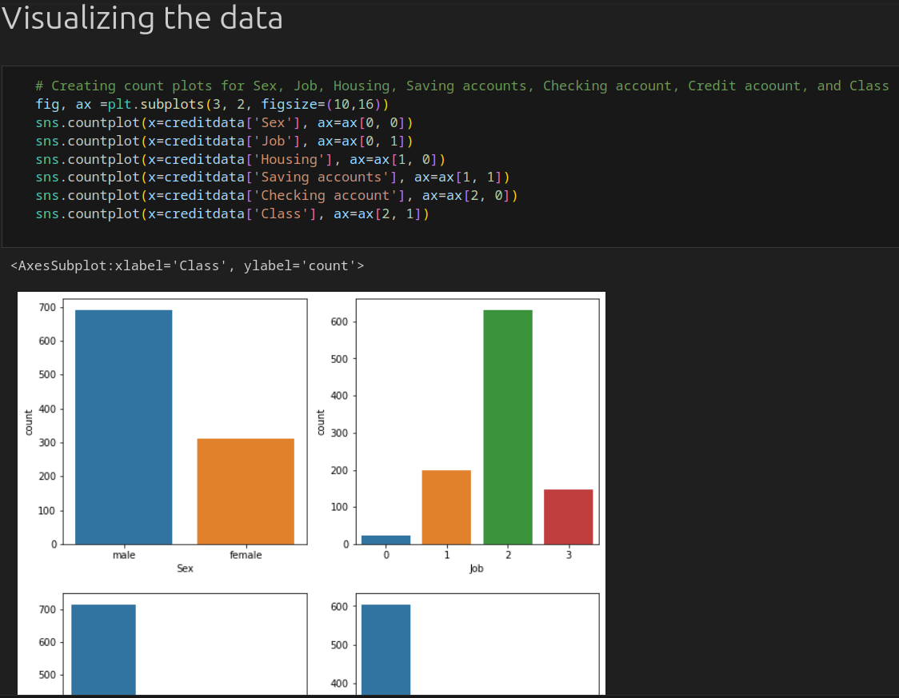

# Logistic Regression and Support Vector Machine Algorithms on Credit Worthiness Report

The project focuses on applying Logistic Regression (LR) and Support Vector Machine (SVM) algorithms to predict the classification of individuals based on their creditworthiness report. Utilizing various features such as Age, Sex, Job, Housing, Saving accounts, Checking account, Credit amount, and Duration, the study aims to determine the most effective model for this prediction. By evaluating and comparing the loss function of both LR and SVM, the project seeks to identify the optimal algorithm for accurately categorizing individuals' creditworthiness.

## Demonstration

## The models

For this task, both Logistic Regression (LR) and Support Vector Machine (SVM) were used to help predict the class
that individuals would belong to using other features.
These features included: Age, Sex, Job, Housing, Saving accounts, Checking account, Credit amount, and Duration.
Besides, the task aimed to establish which was the best model to employ by reducing and comparing the loss function of both models.

## Dataset

A German credit dataset from the instructor was used. The data comprised 10 variables and 1,000 observations

## Data pre-processing

For the preprocessing part, there were two main columns with null values.
That is, Saving accounts, and Checking accounts. In this case, the mode of each column was used to fill in the missing values.

## Data Visualizations

A count plot was used to visualize the data and understand different items in the variables.

## Splitting the data

The data was split in the ratio of 0.7 for the training and 0.3 for the testing.
The independent variable comprised every variable except the **Class** variable,
whereas the dependent variable only contained the **Class** variable.

Applying the model, prediction, and results
After fitting the models, a prediction error of 27.67% was realized for the LR and 23.40% for the SVM.

### Conclusion
*Part 1:*
Having the least prediction error, the SVM model emerged as being the best in the variable class prediction.

*Part 2:*
The training process was terminated after lowering the loss function to as low as possible.

*Part 3:*
Classification accuracy for hold-out test: 0.7529

*Part 4&5:*

a. To avoid overfitting of the model, cross-validation was applied, in which multiple mini train-test splits were used to fine-tune the model.
b. The extended accuracy: Though not much accuracy was extended, at least the model was able to achieve a 0.7927 accuracy after several methods were used to avoid overfitting.
